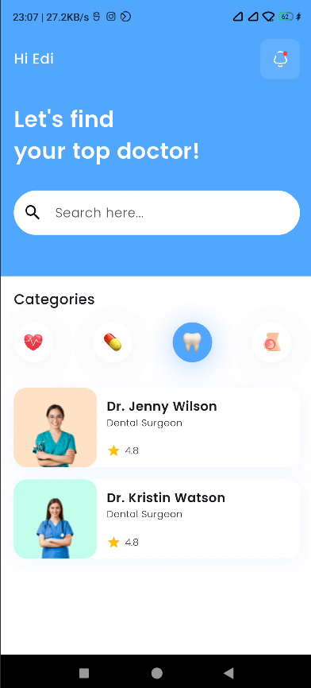
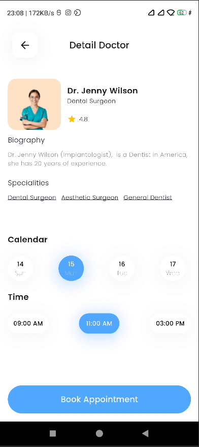
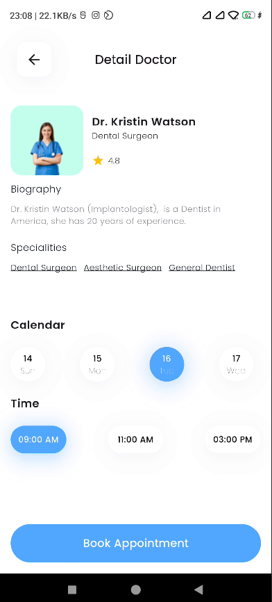

# 🩺 Medical App UI

This Flutter app is a clean and modern healthcare-themed UI.

## 📱 Features

- Custom-designed medical dashboard UI
- Use of `MatieralApp`, `Scaffold`, `ListView`, `Icons`, `Containers`,`Svg Package` and more
- Organized widget hierarchy for clean and reusable code
- Fully responsive layout design

## 🧠 What I Learned

- UI layout and composition in Flutter
- Building layered and interactive screens
- Creating reusable components

## 📸 Screenshots

---

📁 Part of my [flutter-journey](https://github.com/bisheshshrestha/flutter-journey) repo where I document all my Flutter learning projects.
